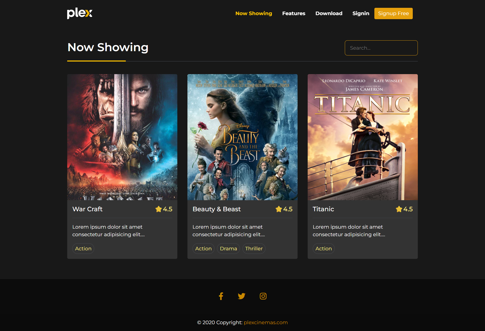

<h1 style="font-weight:600">1. Homepage</h1>

 
<h1 style="font-weight:600">2. Movies</h1>

 
<h1 style="font-weight:600">3. Movie Details</h1>

 
<h1 style="font-weight:600">4. Seat Booking</h1>

 
<h1 style="font-weight:600">5. Login</h1>

 
<h1 style="font-weight:600">6. Register</h1>

